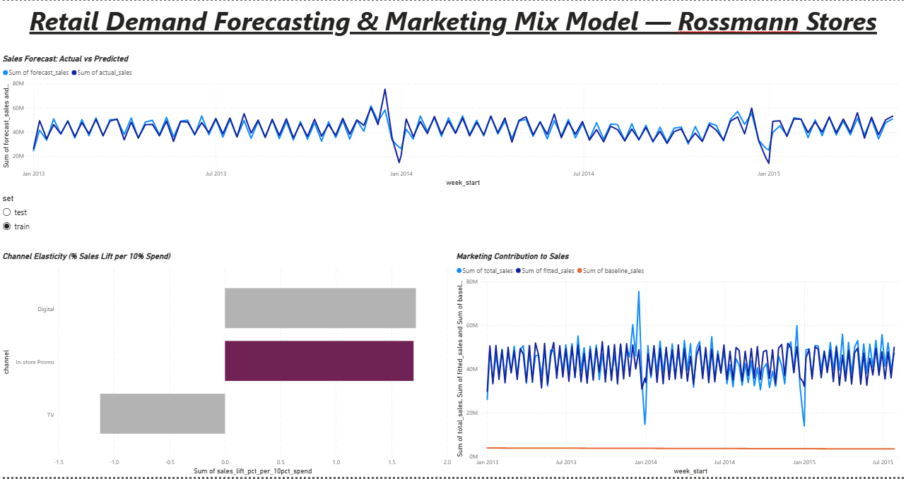

# Retail Demand Forecasting & Marketing Mix Model

End-to-end analytics project on the Rossmann Store Sales dataset (1,115 stores,
Jan 2013 - Jul 2015, ~1M daily records): SQL data pipeline → time-series demand
forecast → marketing mix model → Power BI-ready outputs.

## Dashboard

Three views: weekly sales forecast (actual vs predicted), marketing-driven
contribution to sales (fitted vs baseline), and channel elasticity showing
which spend channel actually moves sales.

## Business problem
Retail chains need to (1) forecast near-term demand for inventory/staffing
planning and (2) understand which marketing/promo channels actually drive
sales, so spend can be allocated efficiently. This project builds both.

## Data
- **Source:** Rossmann Store Sales (Kaggle competition dataset)
- **Scope:** 1,115 stores, daily sales/customers/promo/holiday flags, 2013-2015
- **Marketing spend:** No public spend data exists for this dataset. A weekly
  spend-by-channel table (TV / Digital / In-store Promo) was synthetically
  generated, correlated to real promo activity + trend + noise -- standard
  practice for portfolio MMM projects when real spend data isn't public.

## Pipeline

| Stage | What it does | File |
|---|---|---|
| 1. Load & clean | Raw CSVs → SQLite, filter closed/zero-sales days, join store attributes, aggregate to weekly grain | `scripts/01_load_and_clean.py` |
| 1b. Spend layer | Synthetic weekly marketing spend by channel | `scripts/02_generate_marketing_spend.py` |
| 2. Forecasting | Prophet model, promo/holiday as external regressors, 12-week holdout | `scripts/03_forecast_model.py` |
| 3. MMM | Log-log OLS regression → channel elasticities | `scripts/04_mmm_regression.py` |

## Results

**Forecasting**
- Test MAPE: **6.6%**, RMSE: ~3.4M (on weekly company-wide sales, 12-week holdout)

**Marketing Mix Model** (R² = 0.55)
| Channel | Elasticity | Sales lift per 10% spend increase | Significant? |
|---|---|---|---|
| In-store Promo | +0.17 | +1.70% | Yes (p<0.05) |
| Digital | +0.17 | +1.72% | No (p=0.10) |
| TV | -0.11 | -1.12% | No (p=0.56) |

TV/Digital insignificance is driven by multicollinearity -- all three channels
were constructed as correlated with the same underlying promo signal, so
in-store promo (strongest single correlate) absorbs most of the explained
variance. This is flagged in the regression's condition number and is a
realistic MMM finding worth discussing in interviews.

## Outputs (for Power BI)
- `outputs/forecast_results.csv` -- actual vs forecast sales, train/test split, confidence bands
- `outputs/mmm_results.csv` -- actual vs fitted sales, baseline vs spend-driven decomposition
- `outputs/mmm_elasticities.csv` -- channel elasticity summary table

## Dashboard (Power BI) -- build guide
1. **Forecast view:** line chart of `actual_sales` vs `forecast_sales` from
   `forecast_results.csv`, shaded confidence band (`yhat_lower`/`yhat_upper`), filter by train/test.
2. **Channel contribution view:** waterfall/stacked area from `mmm_results.csv`
   showing `baseline_sales` vs `fitted_sales` gap = spend-driven lift.
3. **Elasticity table:** `mmm_elasticities.csv` as a simple KPI card/table --
   "$X spend increase in [channel] → Y% sales lift."

## Tech stack
Python (pandas, Prophet, statsmodels), SQLite (SQL layer), Power BI (dashboard)

## Resume line
"Built a demand forecasting and marketing mix model on 1M+ retail transaction
records, achieving 6.6% forecast MAPE and quantifying promotional elasticity
to inform spend-allocation decisions, with a Power BI dashboard for
stakeholder reporting."
